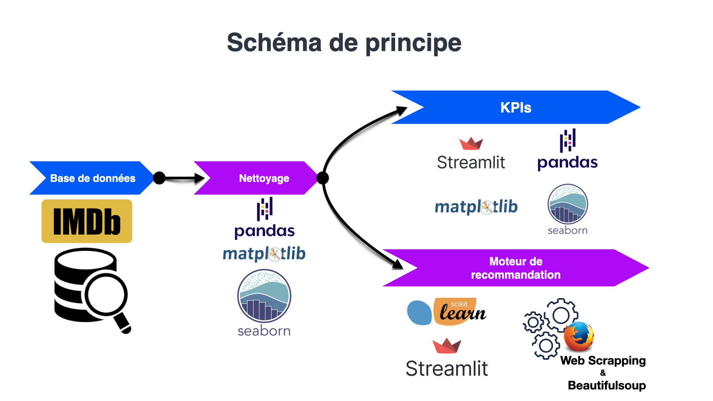
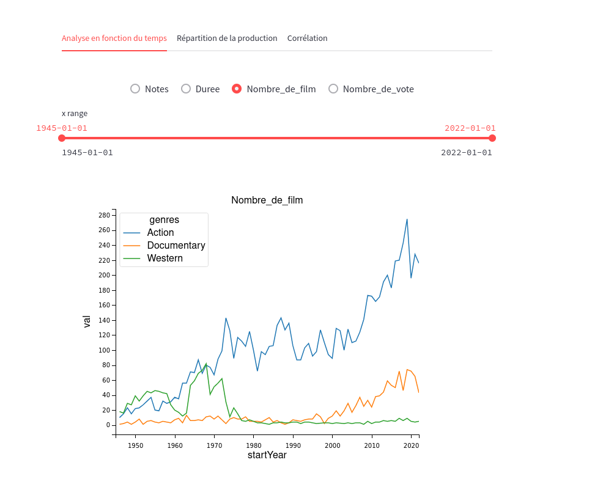
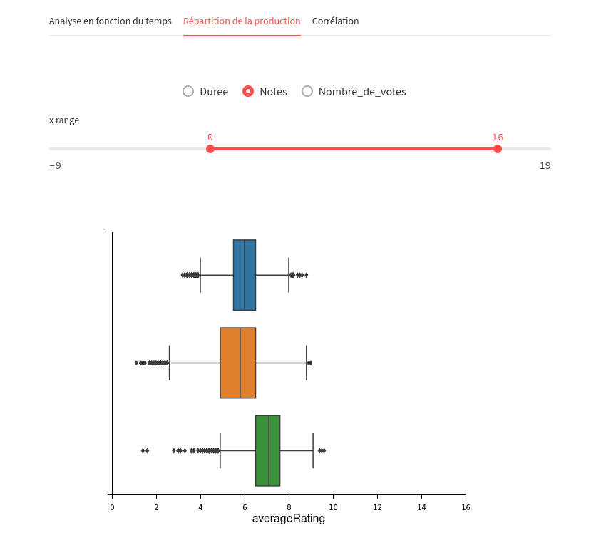
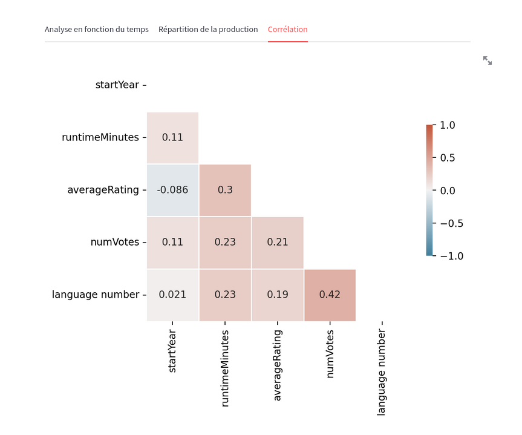
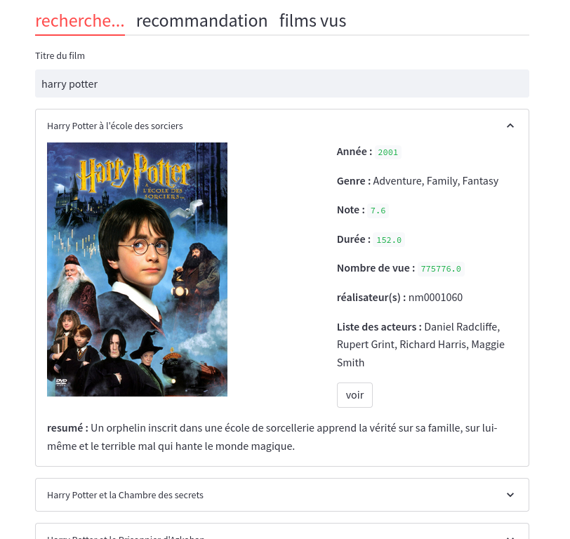
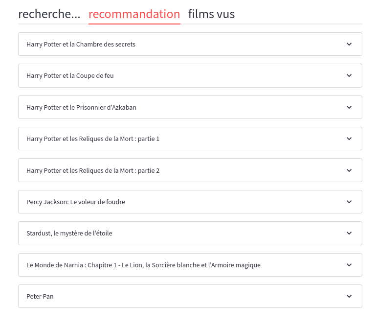

# recommendation-movie-WCS
projet 2 de la WCS : 
 - nettoyage de la base de données IMdb
 - création de KPis pour analyser la production cinématographique
 - création d’un moteur de recommandation de film 

# L'Equipe du projet
- [https://github.com/racettour]( Raphaël Cettour) 
- [https://github.com/Anthowheels](# Anthony Etienne) 
- François Albert https://github.com/francoisalb
- [Florian Allory] (#https://github.com/FlorianAllory)

    

# :ledger: Index

- [Project goal](#beginner-project-goal)
- [Future developments](#wrench-future-developments)
- [Gallery](#camera-gallery)
- [License](#lock-license)

# :beginner: Les différentes étapes du projet
1. Analyse des besoins et des attentes du client

2. Chargement des différentes base de données

- name.basics.tsv.gz
- title.akas.tsv.gz
- title.basics.tsv.gz
- title.crew.tsv.gz
- title.principals.tsv.gz
- title.ratings.tsv.gz

3. Analyse et nettoyage des données pertinentes en vue de leur exploitation

4. Création de KPIs sur streamlit

5. Création du moteur de recommandation de film 
- choix de l'IA : K-Nearest Neighbours de Scikit Learn
- Création d'une interface graphique sur streamlit
- Web scraping :récupération de l’affiche et du résumé des films sur le site IMdb

# :twisted_rightwards_arrows: schéma de principe

# :wrench: Futur développements
  - Intégrer les séries dans la base de données
  - Etudier une/des solution(s) pour compléter les infos manquantes (NaN) et enrichir la base de données
  - Test utilisateur
  - Gestion d’erreur
  - Remplacer l’identifiant du réalisateur par son nom

#  :camera: Gallery
## 1. KPI example

Grapique linéaire nous décrivant l'évolution du nombre de films produit par année

Boîte à moustache représentant les notes de films en fonction de trois genres (Action, Documentaire, Western)

Matrice de corrélation

## 2. KPI example

Choix d'un film pour le moteur de recommendation

Exemple de recommandations suite à la sélection Harry Potter

#  :lock: License
Add a license here, or a link to it.
